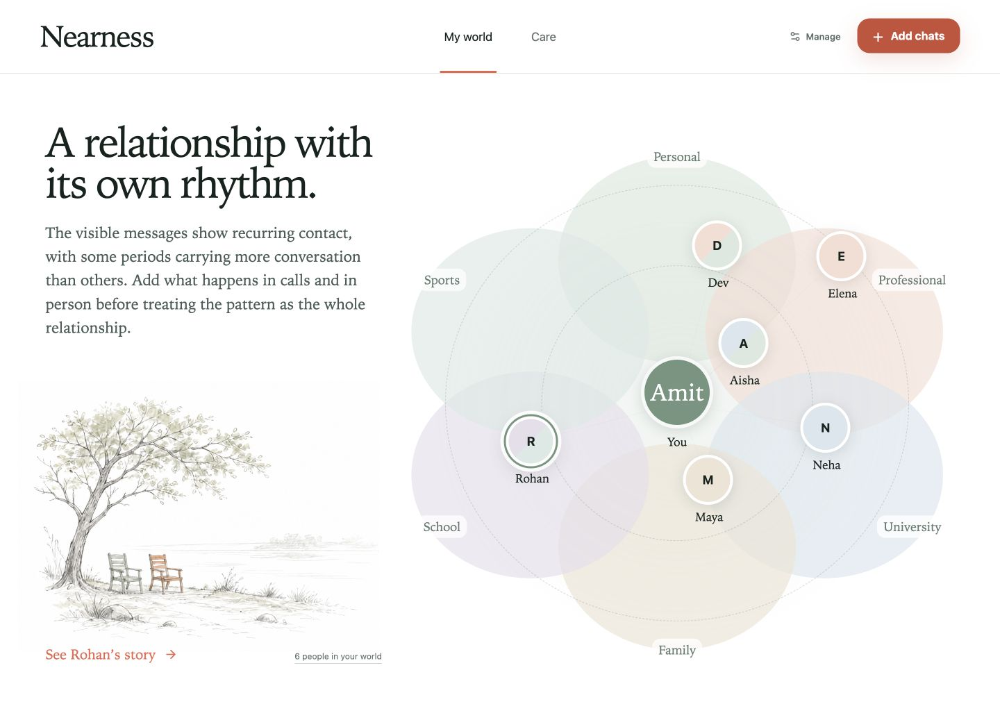

# Nearness

Nearness is a private, local-first relationship atlas for friends, family, chosen family, groups and life chapters.

It imports history you already own, keeps it in an encrypted vault on your Mac, separates visible evidence from your lived account, and helps you care for selected relationships without rankings, streaks or guilt.



## What is working

- WhatsApp ZIP/TXT imports with multiline, date-order and attachment handling.
- Updated WhatsApp exports merge into the existing conversation without double-counting earlier messages.
- Read-only Apple Messages linking from `~/Library/Messages/chat.db`, including modern `attributedBody` text.
- vCard contact imports for cross-source identity proposals.
- A two-sender export can be confirmed as a group instead of being silently treated as a direct chat.
- User-confirmed identity resolution; a name-only match never auto-merges people.
- A field-encrypted local SQLite vault protected by a macOS secure-storage key.
- User-controlled bond system, closeness, trajectory, relationship form, social worlds, intention and cadence.
- Local communication signals with explicit coverage limits.
- Optional, per-run AI portraits and questions using redacted representative excerpts, evidence references and `store: false`.
- Capacity-aware Care suggestions with protected unallocated time and first-class rest/boundary intentions.
- Local JSON export, source removal and complete vault deletion.

## What Nearness refuses to do

Nearness does not rank friends or infer diagnosis, attachment style, toxicity, romantic intent, deception, personality, culture from a name, emotion from gender, relationship quality from sentiment, or closeness from message volume.

The framework is research-informed and experimental. It is not a clinical or psychometric instrument.

## Run locally

Requirements: macOS 13+, Apple Silicon, Node.js 24+, npm 11+.

```bash
npm install
npm run dev:desktop
```

To bootstrap a founder/development OpenAI key from an existing env file without copying or printing it:

```bash
NEARNESS_BOOTSTRAP_KEY_FILE=/absolute/path/to/.env.local npm run dev:founder
```

Public users can add their own API key inside **Data & privacy → Privacy & AI**. The key is protected by macOS secure storage and is not included in exports.

## Build and test

```bash
npm run verify
npm run package:mac
```

The resulting DMG and ZIP are written to `release/`. Public distribution also requires an Apple Developer ID certificate and notarization; an unsigned build is suitable for founder testing but macOS will show the standard unidentified-developer warning.

For a founder test, import one WhatsApp conversation first, confirm who you are in the preview, then add what the archive cannot know from the person story. AI analysis is optional and only becomes available after the exact redacted payload is reviewed and approved for that run.

## Privacy architecture

The renderer is sandboxed and cannot read files, the database or API keys. Imports and decryption live in the Electron main process behind a small IPC allowlist. Personal text, names, handles, notes, portraits and care reasons are AES-256-GCM encrypted; equality fields use keyed HMACs. Messages is read from a temporary copy so Nearness never writes to Apple’s database.

AI is not part of import. For each requested portrait or answer, Nearness:

1. selects representative excerpts locally;
2. redacts names, obvious phone numbers, emails, links and street-like addresses;
3. shows the count, coverage, missing channels and sample;
4. waits for explicit consent;
5. sends the request with storage disabled;
6. rejects observations without valid evidence references or with prohibited inference language.

See [PRIVACY.md](PRIVACY.md), [SECURITY.md](SECURITY.md) and [docs/relationship-framework.md](docs/relationship-framework.md).

## Open source

Nearness is released under the MIT License. Contributions must preserve the evidence boundary, local-first defaults and prohibited-inference catalogue.
